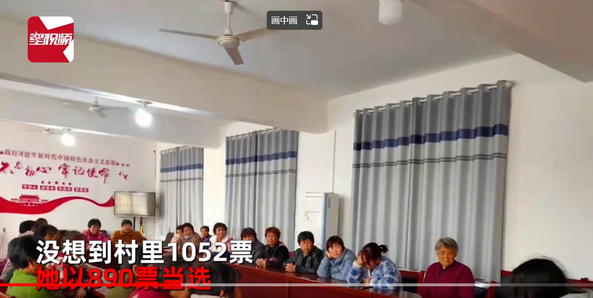

今天，老师根据讲课内容给我们布置了一篇撰写消息的作业。具体内容不限，主要是要求大家能够及时将所学所思转化为生产力，对于这样的任务，我能有什么想法呢，按要求执行呗。

于是我在网上找了找素材，突然看到了一个视频，视频链接为：https://haokan.baidu.com/v?vid=7637514420175947431&pd=bjh&fr=bjhauthor&type=video 。

讲的是一名24岁女大学生稀里糊涂的当选上了自家村的村长，本以为钱多事儿少离家近，没想到却掉进了“大坑”。但她不轻易言弃，带领乡亲们奋力建设家乡的故事。

故事挺简短的，但想要将其改写好却并不容易。首先，要满足新闻基本的“5W1H”原则，同时要有新意，最重要的一点是标题要够吸引人。

于是我开始了我的写作：

**听说当村长事少工资高，24岁女大学生当选后直呼受不了！！！**

假设现在有一份钱多事少离家近，还是当村长的工作摆在你面前，你心动嘛？

3月17日，河南省鹤壁市三家村一24岁女大学生张丽（化名）在网络上给出了她的答案。

起初她只听说当村长事少工资高，就抱着玩一玩的心态参加了村里的选举，没成想在1052份选票中，她竟然获得了890票，高票当选为该村新一任村长。

万万没想到的是，等待她的不是梦想中的事少工资高，而是满村的断壁残垣以及高达百万元的债务，她直呼受不了，差点选择放弃。

但为了家人，最后她还是选择扛起责任面对，组织大家为村里修路、铺设水管、清理河道，还为村里修建起了第一个公共厕所、图书馆、篮球场和电影院，极大的丰富了村民的业余文化生活。

为将乡村建设的更美，她甚至欠钱让朋友帮村里画艺术文化墙，等有收益后再结账。村子经过媒体报道后，她的乡村治理工作也得到了领导的重视，意外获得了一份环境治理的奖金，于是她将朋友的欠款还清后再次投入到美丽乡村的治理中去了。

青年兴则国家兴，乡村振兴离不开青年人才的参与和建设，为女村长点赞！

